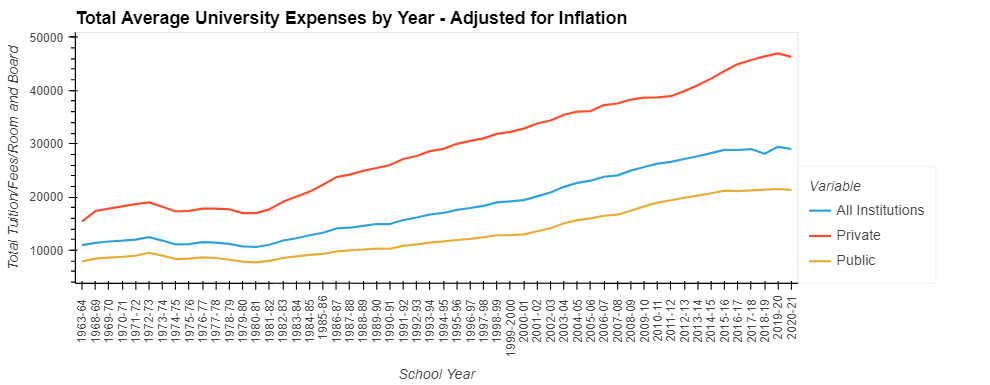
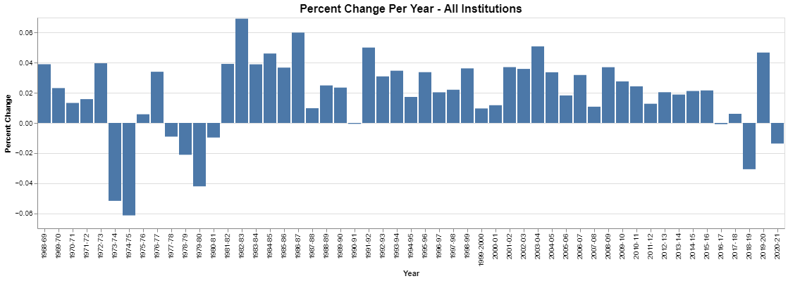
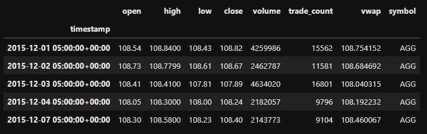
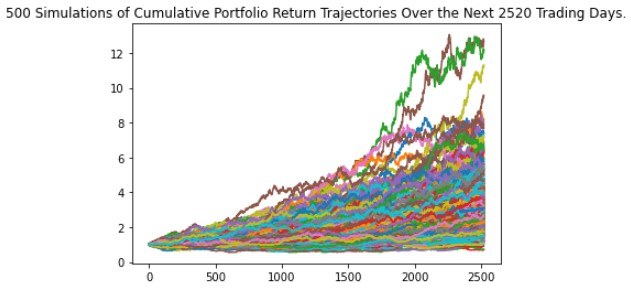
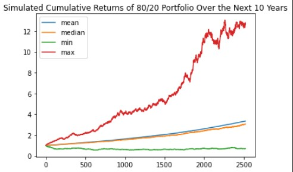
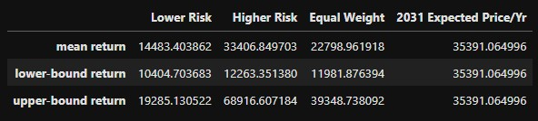
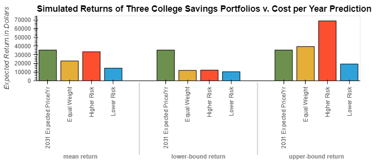

# Planning for College
An analysis of how the price of university has changed over time along with a comparison of different possible investment portfolios that families could use to save for their children to go to college.
### Goals
* Use historical tuition data to predict the price of tuition for the year a child will start college
* Assuming an initial investment of a certain dollar amount, use monte carlo simulations to predict how savings portfolios of different weights will compare to each other
* Given the results of these simulations, provide a framework for families to set expectations for their children for how much of their tuition will be covered by the family's savings, and how much of it will have to come from outside sources such as loans, grants, and/or scholarships.

### Research questions
* How much has the price of university changed over the past 60 years after accounting for inflation?
* How much can we expect the price to increase each year?
* What is the average difference in price between public and private university?
* With an initial investment of 10,000 dollars, how much can a family expect to have saved after 10 years for each portfolio? How does that compare to the predicted cost of university after 10 years?
* Is one portfolio better than another in the given scenario?

---

## Part 1: Analyzing the Tuition Data
In this section, we will prepare and analyze data taken from the [National Center for Education Statistics](https://nces.ed.gov/programs/digest/d21/tables/dt21_330.10.asp).

### Which data to use for the analysis?
The initial DataFrame that we created after importing the CSV file contained a variety pricing data, such as the costs of tuition, fees, and room and board, as well as all of those costs together. For the purpose of this project, we decided only to use the data for tuition, fees, and room and board together. In addition, the file provided data showing the actual dollar amount for the years provided, as well as those prices adjusted for inflation. In order to create more accurate predicitons, we decided to use only the inflation-adjusted data for our analysis.

The notebook `separating_dataframes.ipynb` shows the process of separating and cleaning the data from the initial CSV file into three different DataFrames, then saving those DataFrames to their own CSV files to be used in our other notebooks. These DataFrames contain average pricing data for all public institutions, all private institutions, and both types together. For this analysis, we chose to only analyze the pricing data for a traditional four-year education. We concatenated the 4-year pricing data for each type into one DataFrame to use for analysis.

### Visualizing Pricing Data

With this historical pricing DataFrame, we were able to generate summary statistics as well as create visualizations showing the price trend over time.



### Research Questions:
* What is the average difference in price between public and private university?

Adjusted for inflation, the summary statistics from the `all_tuition_df` DataFrame show a mean total cost per year of 29,164 dollars for private university, and a mean total cost per year of 13047 dollars per year for public university over all of the years studied, making the average difference 16117 dollars per year.
* How much has the price of university changed over the past 60 years after accounting for inflation?

Adjusted for inflation, the average total cost across all institutions for one year of university for the 1963-1964 school year was 10,973 dollars. For the 2020-2021 school year, it was 29,033 dollars. This shows an increase in cost per year of 18,060 dollars between 1963 and 2021.



### Research Question: How much can we expect the price to increase each year?
These statistics tell us that, overall, the price of tuition between all institutions increased by around 2 percent each year. Since the goal of our project is to give families a ballpark estimate of how much they can expect college to cost after a certain number of years, we can calculate the estimated cost by assuming a 2 percent increase for each year.

Assuming this 2 percent increase and using the most recent pricing data as a starting point, we can use the Future Value formula to calculate a price estimate over a certain number of years. In the following example, we use this formula to estimate the total costs for a public institution in 2031, which came to 26009.68.

```
def calculate_future_price(current_price, number_of_years):
    future_price = current_price * (1 + .02) ** number_of_years
    return future_price

price_2031 = calculate_future_price(21337, 10)
```
We used this formula later to compare the price estimate for all institutions to the performance of our portfolios.

## Part 2: Comparing Portfolios
In simulating these different stock portfolios, our goal is to provide an alternative to a traditional savings account that would allow families to invest in their children's future education while mitigating risk. We decided to keep these portfolios simple by composing them of two Exchange-Traded Funds (ETFs), the SPDR S&P 500 ETF Trust (SPY), and the iShares Core US Aggregate Bond ETF (AGG). By providing Monte Carlo simulations of different weights, we are able to provide a tool for families to make an informed decision on which type of portfolio would best meet their needs.

### Collecting the Data
We used the Alpaca Trade API to collect data for the two ETFs and calculate the daily returns for each. We then used that daily return data as the basis for our Monte Carlo simulations.

```
#generate a dataframe of the stock data
df_portfolio = alpaca.get_bars(
    tickers,
    timeframe,
    start = start_date,
    end = end_date
).df

df_portfolio.head()
```



### Creating and Analyzing Monte Carlo Simulations
Once we calculated the daily returns for the two ETFs, we created our simulation objects. The first simulation had an 80/20 weight between SPY and AGG, generating 500 simulations over 10 years. That represented our higher risk portfolio, since it is composed of 80% stocks and 20% bonds. We also created a simulation for a lower-risk portolio composed of 20% stocks and 80% bonds, and a balanced portfolio equally weighted between stocks and bonds.

We chose the 10 year number for our simulations to represent a scenario where the child we are saving for is currently 8 years old, so we would expect them to go to college in 10 years. The simulations could be easily adjusted to account for children of different ages.

We generated plots of each simulation, as well as their summary statistics. Here are the plots for our higher risk portfolio simulation:





### Using Summary Statistics to Calculate Possible Outcomes
To answer our research questions, we used summary statistics to calculate the possible outcomes for each portfolio. Using a 95% confidence interval, we can get an idea of the general range of outcomes, along with looking at the mean outcome.

In this scenario, we will assume that a family with an 8-year-old child has made an initial investment of 10,000 dollars. To calculate the outcomes, we multiplied the initial investment by the 95% upper and lower confidence intervals, as well as the mean.

```
# Use the lower and upper `95%` confidence intervals to calculate the range of the possible outcomes for the higher-risk portfolio
ci_lower_hrp_cumulative_return = higher_risk_summary_statistics[8] * initial_investment
ci_upper_hrp_cumulative_return = higher_risk_summary_statistics[9] * initial_investment
hrp_cumulative_return_mean = higher_risk_summary_statistics[1] * initial_investment
```

## Research Question: With an initial investment of 10,000 dollars, how much can a family expect to have saved after 10 years for each portfolio? How does that compare to the predicted cost of university after 10 years?
The following DataFrame and bar chart show the expected results of each portfolio in comparison to the average cost per year of university. For the average cost per year, we used the future value function with the average price for all institutions in 2020-2021, which was 29,033 dollars. We can see that in some scenarios the initial investment of 10,000 dollars could be enough to cover one year of university costs, however since most students take around four years to complete their bachelor's degree, it would not come close to covering the full expense.

To make up for this discrepancy, the family could make a higher initial investment and/or add more shares into the portfolio over time. Of course, there are also many other ways for students to pay for education as well, such as scholarships, grants, and loans.

```
#create a DataFrame to compare the expected returns
price_all_2031 = calculate_future_price(29033, 10)
comparison_df = pd.DataFrame(
        {'Lower Risk':[lrp_cumulative_return_mean, ci_lower_lrp_cumulative_return, ci_upper_lrp_cumulative_return],
         'Higher Risk':[hrp_cumulative_return_mean, ci_lower_hrp_cumulative_return, ci_upper_hrp_cumulative_return],
         'Equal Weight':[ewp_cumulative_return_mean, ci_lower_ewp_cumulative_return, ci_upper_ewp_cumulative_return],
         '2031 Expected Price/Yr':price_all_2031
        }
)
#set the index for the DataFrame
sim_index = ['mean return', 'lower-bound return', 'upper-bound return']
comparison_df.index = sim_index
```



```
#configure the hover to display standard notation
hover = HoverTool(
    tooltips=[
        ( 'value', '@value{0.00 a}'      ),
    ]
)
#configure bar chart
comparison_df.hvplot.bar(
    ylabel='Expected Return in Dollars',
    title='Simulated Returns of Three College Savings Portfolios v. Cost per Year Prediction',
    rot=90
).opts(
    tools=[hover]
)
```



## Research Question: Is one portfolio better than another in the given scenario?
In our simulations, the higher-risk portfolio appears to have performed better than the other two, even in the lower-bound prediction, although the difference was minimal. Since we only evaluated ETFs, which are less risky overall than investing in individual stocks, it seems that the increased level of risk for our higher-risk portfolio did not hurt its performance enough to decrease its attractiveness as an investment option.

---

## Technologies
* Jupyter Lab and Jupyter Notebooks
* Python 3.9
* Python libraries: Pandas, Numpy, Pathlib, OS, Alpaca Trade API, Holoviews, Altair, Dotenv, Bokeh
* MC Forecast Tools

Use of this project requires an Alpaca API key and Alpaca secret key.

---

## Contributors

[Lydia Ciummo](https://github.com/lydiaciummo)

[Ryan Svendson](https://github.com/RyanSvendson)

[David Hutsell](https://github.com/dhut1621)